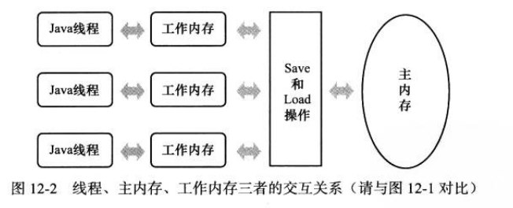

## volatile的语义

1. 保证此变量对所有线程的可见性
2. 禁止指令重排优化

和C++提供的volatile关键字，并不是一样的效果。c++的volatile没有第二个语义，java的volatile关键字是更完整的实现。

保证此变量对所有线程的可见性，通过编译器就能实现。对变量的操作，每次都从主内存读取，就可以保证可见性。
而指令重排就比较复杂，在执行程序时为了提高性能，编译器和处理器都会指令做重排序，分为下面三种类型

1. 编译器优化的重排序。编译器在不改变单线程程序语义的前提下，可以重新安排语句的执行顺序。
2. 指令级并行的重排序。现代处理器采用了指令级并行技术（Instruction-Level Parallelism， ILP）来将多条指令重叠执行。如果不存在数据依赖性，处理器可以改变语句对应机器指令的执行顺序。
3. 内存系统的重排序。由于处理器使用缓存和读/写缓冲区，这使得加载和存储操作看上去可能是在乱序执行。


第一种重排序，编译器在处理volatile变量时，禁用优化就能够防止重排。后面两种则需要通过内存栅栏来防止重排。

## 通过内存栅栏阻止重排优化

内存栅栏或内存屏障（memory barrier），是处理器提供的一种同步指令。确保此点之前的所有读写操作都执行并同步到内存中。

不同的处理提供不同的指令，比如x86提供的内存栅栏指令`lfence`,`sfence`,`mfence`。

- lfence：指令前所有读取指令（load-from-memory）都必须完成。
- mfence：指令前所有读写指令（load-from-memory and store-to-memory）都必须完成。

java中不用直接涉及内存栅栏，java用内存模型，更全面的解决这些问题。

比如java的`volatile`关键字。
查看volatile变量的汇编代码，发现对变量操作前多了lock指令，这个指令提供了一个memory barrier（重排序不能把后面的指令，排序到memory barrier的前面）。

>`lock`指令，根据IA32手册描述，作用是把cpu的cache写入内存，同时让其他cpu的缓存无效化。这就可以实现可见性和避免指令乱序，因为内存栅栏（memory barrier）之前的都需要同步到内存中。

```asm
0x01a3de24:lock addl $0x0,(%esp)
```
---
## java内存模型

java内存模型屏蔽了各平台内存的差异。定义了对变量的写入操作在何时对其它线程可见。主要有工作内存和happens-before两个概念。

### 工作内存

java内存模型中，加入了工作内存和大量规则，来控制变量的可见性。工作内存就类比cpu的高速缓存一样。在内存之上又加了一层。但我们只用关心happens-before就好了。



### happens-before

happens-before定义了代码操作的偏序关系，只要满足这个偏序关系，我们就能判断执行的先后顺序。而不用具体管编译器和cpu会对指令重排做哪些操作。

这里要注意，happens-before和代码执行的时间先后顺序的区别。

比如下面代码，时间上，如果线程A先调用`setValue(5)`，线程B再调用getValue。取出来的值很可能是5，但不能确定。因为他们不满足happens-before。可能一些优化导致set的值不可见。
```java
class A{
    private int value = O;
    pubilc setValue (int value) {
        this.value =value;
    }
    public int getValue(){
        return value;
    }
}
```
## 双锁模式在单例中的应用

在java中，通过volatile变量，就能保证双锁模式正常使用。其中加入localRef局部变量，减少对volatile变量的使用，来提高程序性能。
```java
class Foo {
    private volatile Helper helper;
    public Helper getHelper() {
        Helper localRef = helper;
        if (localRef == null) {
            synchronized (this) {
                localRef = helper;
                if (localRef == null) {
                    helper = localRef = new Helper();
                }
            }
        }
        return localRef;
    }
}

```

而c++中，只能加入内存栅栏，来保证双锁模式的正确使用。
```c++
static std::atomic<Singleton*> Singleton::m_instance = nullptr;
static std::mutex Singleton::m_mutex;

Singleton* Singleton::getInstance() {
    Singleton* tmp = m_instance.load(std::memory_order_acquire);
    if (tmp == nullptr) {
        std::lock_guard<std::mutex> lock(m_mutex);
        tmp = m_instance.load(std::memory_order_relaxed);
        if (tmp == nullptr) {
            tmp = new Singleton;
            m_instance.store(tmp, std::memory_order_release);
        }
    }
    return tmp;
}
```
