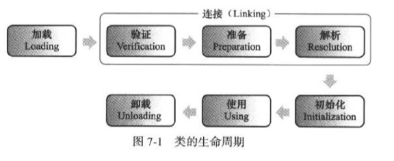

## 类文件

与c，c++编译成目标文件不同，java是编译成类文件。平台无关的类文件就构成了java跨平台的基石。

### 类文件的结构

编译好的class文件，可以用`javap -verbose`来解析类文件的详细信息。

```auto
Constant pool:
   #1 = Methodref          #7.#22         // java/lang/Object."<init>":()V
   #2 = Fieldref           #4.#23         // A.a:I
   #3 = Fieldref           #4.#24         // A.b:I
   #4 = Class              #25            // A
   #5 = Methodref          #4.#22         // A."<init>":()V
   #6 = Methodref          #4.#26         // A.sum:(I)I
   #7 = Class              #27            // java/lang/Object
   {
     volatile int a;
       descriptor: I
       flags: ACC_VOLATILE

       public static void main(java.lang.String[]);
         descriptor: ([Ljava/lang/String;)V
         flags: ACC_PUBLIC, ACC_STATIC
         Code:
           stack=2, locals=1, args_size=1
              0: new           #4                  // class A
              3: dup
              4: invokespecial #5                  // Method "<init>":()V
              7: iconst_3
              8: invokevirtual #6                  // Method sum:(I)I
             11: pop
             12: return
           LineNumberTable:
             line 11: 0
             line 12: 12
      }
```
其中最重要的四个表
1. 常量池（constant_pool）：符号
2. 字段表，方法表：两个表格式一样，描述字段和方法的签名。类型，参数，访问控制等。
3. 属性表：字段和方法表，都携带属性表，属性表是最灵活的。包括方法的字节码都放在“code”属性中

其中调用sum方法的字节码`invokevirtual #6`，#6的常量池，描述了调用的方法是属于哪个类的哪个方法。所以，java不能像python那样动态调用方法。

### 动态加载类文件

编译好的类文件，不用进行静态链接，直接就可以运行。没有静态链接，就不会引入系统相关的库，保证了java的跨平台。

类文件，通过类加载器加载在合适的时间加载，然后动态链接，初始化。



### 字节码生成以及动态代理
- 字节码生成（静态代码）

通过`javassist`等库，对加载进来的class文件进行修改，达到增强原来class代码的目的。比如对所有实体类包下的class都添加一个save的方法。这样修改的代码，减少了手写代码的
工作量，而且只有初次增强代码时候的消耗。
- 动态代理

对比上面的字节码生成。

利用Java的Proxy类，调用Proxy.newProxyInstance()，创建动态对象十分简单。

```java
Hello hello = new Hello();
IHello helloInter = (IHello) Proxy.newProxyInstance(hello.getClass().getClassLoader(), hello.getClass().getInterfaces(),
		new InvocationHandler() {
			@Override
			public Object invoke(Object arg0, Method arg1, Object[] arg2) throws Throwable {
				return method.invoke(hello, par);
			}
		});
helloInter.sayHello();
```

动态代理，会动态生成一个$Proxy0.class的类，实现动态代理接口的所有方法。都是调用InvocationHandler的invoke，并传入通过反射获取的原来Hello的方法。
## 反射

使用反射不同于常规的Java编程，其中它与 元数据--描述其它数据的数据协作。Java语言反射接入的特殊类型的原数据是JVM中类和对象的描述。反射使您能够运行时接入广泛的类信息。它甚至使您能够读写字段,调用运行时选择的类的方法。

### 得到class对象
1. `MyClass.class`
2. `object.getClass()`
3. `Class.forName(name)`
